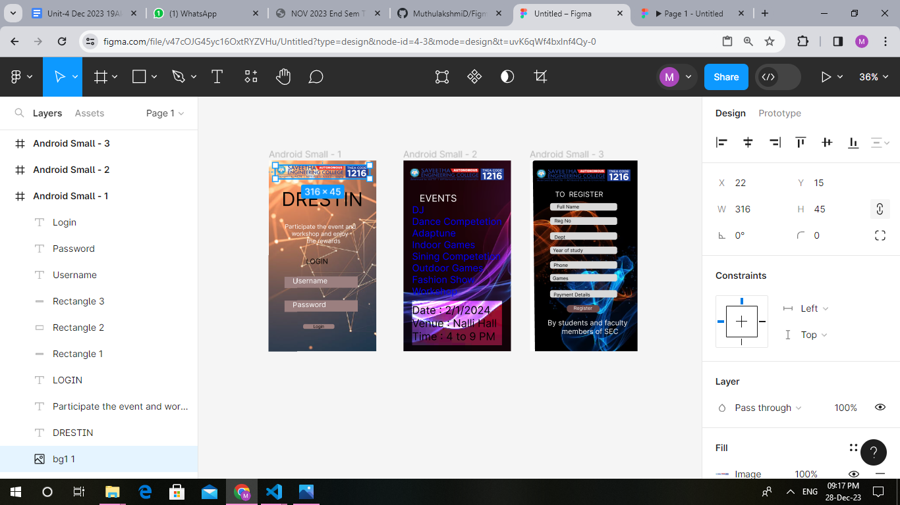

# Ex09 Event Registration Web Application
## Date:28/12/2023

## AIM:
To design, develop and deploy a web application for event registration.

## DESIGN STEPS:

### Step 1:
Create a new frame.

### Step 2:
Select any one preset size of your choice.

### Step 3:
Select the shapes you need.

### Step 4:
Import images as needed.

### Step 5:
Create pages based on your need and link them.

### Step 6:

Validate the HTML and CSS code.

### Step 6:

Publish the website in the given URL.

## DESIGN TOOL:
Figma

## CODE:
```
Android-1
<div style="width: 100%; height: 100%; position: relative; background: white">
    
    
    <div style="left: 43px; top: 91px; position: absolute; color: black; font-size: 64px; font-family: Inter; font-weight: 400; word-wrap: break-word">DRESTIN</div>
    <div style="left: 54px; top: 210px; position: absolute; color: white; font-size: 20px; font-family: Inter; font-weight: 400; word-wrap: break-word">Participate the event and <br/>    workshop and enjoy<br/>             the rewards</div>
    <div style="width: 85px; height: 23px; left: 125px; top: 324px; position: absolute; color: black; font-size: 24px; font-family: Inter; font-weight: 400; word-wrap: break-word">LOGIN</div>
    <div style="width: 244px; height: 38px; left: 54px; top: 389px; position: absolute; background: #9B7F7F"></div>
    <div style="width: 244px; height: 38px; left: 54px; top: 469px; position: absolute; background: #9B7F7F"></div>
    <div style="width: 105px; height: 16px; left: 115px; top: 549px; position: absolute; background: #9B7F7F; border-radius: 6px"></div>
    <div style="left: 81px; top: 389px; position: absolute; color: white; font-size: 24px; font-family: Inter; font-weight: 400; word-wrap: break-word">Username</div>
    <div style="left: 81px; top: 469px; position: absolute; color: white; font-size: 24px; font-family: Inter; font-weight: 400; word-wrap: break-word">Password</div>
    <div style="left: 149px; top: 548px; position: absolute; color: black; font-size: 14px; font-family: Inter; font-weight: 400; word-wrap: break-word">Login</div>
</div>

// DRESTIN
color: black;
 font-size: 64px;
 font-family: Inter;
 font-weight: 400;
 word-wrap: break-word
---
// Participate the event and <br/>    workshop and enjoy<br/>             the rewards
color: white;
 font-size: 20px;
 font-family: Inter;
 font-weight: 400;
 word-wrap: break-word
---
// LOGIN
color: black;
 font-size: 24px;
 font-family: Inter;
 font-weight: 400;
 word-wrap: break-word
---
// Username
color: white;
 font-size: 24px;
 font-family: Inter;
 font-weight: 400;
 word-wrap: break-word
---
// Password
color: white;
 font-size: 24px;
 font-family: Inter;
 font-weight: 400;
 word-wrap: break-word
---
// Login
color: black;
 font-size: 14px;
 font-family: Inter;
 font-weight: 400;
 word-wrap: break-word

 Android-2

<div style="width: 100%; height: 100%; position: relative; background: white">
    
    
    <div style="left: 54px; top: 107px; position: absolute; color: white; font-size: 32px; font-family: Inter; font-weight: 400; word-wrap: break-word">EVENTS</div>
    <div style="left: 29px; top: 146px; position: absolute; color: #0000FF; font-size: 32px; font-family: Inter; font-weight: 400; word-wrap: break-word">DJ<br/>Dance Competetion<br/>Adaptune<br/>Indoor Games<br/>Sining Competetion<br/>Outdoor Games<br/>Fashion Show<br/>Workshop</div>
    <div style="width: 301px; height: 149px; left: 29px; top: 471px; position: absolute; mix-blend-mode: color-dodge; background: #D9D9D9"></div>
    <div style="left: 29px; top: 480px; position: absolute; color: black; font-size: 36px; font-family: Inter; font-weight: 400; word-wrap: break-word">Date : 2/1/2024<br/>Venue : Nalli Hall<br/>Time : 4 to 9 PM</div>
</div>

// EVENTS
color: white;
 font-size: 32px;
 font-family: Inter;
 font-weight: 400;
 word-wrap: break-word
---
// DJ<br/>Dance Competetion<br/>Adaptune<br/>Indoor Games<br/>Sining Competetion<br/>Outdoor Games<br/>Fashion Show<br/>Workshop
color: #0000FF;
 font-size: 32px;
 font-family: Inter;
 font-weight: 400;
 word-wrap: break-word
---
// Date : 2/1/2024<br/>Venue : Nalli Hall<br/>Time : 4 to 9 PM
color: black;
 font-size: 36px;
 font-family: Inter;
 font-weight: 400;
 word-wrap: break-word

 Android-2

 <div style="width: 100%; height: 100%; position: relative; background: white">
    
    
    <div style="left: 84px; top: 99px; position: absolute; color: white; font-size: 24px; font-family: Inter; font-weight: 400; word-wrap: break-word">TO  REGISTER</div>
    <div style="width: 225px; height: 25px; left: 67px; top: 143px; position: absolute; background: #D9D9D9; border-radius: 7px"></div>
    <div style="width: 225px; height: 26px; left: 67px; top: 190px; position: absolute; background: #D9D9D9; border-radius: 7px"></div>
    <div style="width: 225px; height: 25px; left: 67px; top: 241px; position: absolute; background: #D9D9D9; border-radius: 7px"></div>
    <div style="width: 225px; height: 25px; left: 67px; top: 338px; position: absolute; background: #D9D9D9; border-radius: 7px"></div>
    <div style="width: 225px; height: 25px; left: 67px; top: 289px; position: absolute; background: #D9D9D9; border-radius: 7px"></div>
    <div style="width: 225px; height: 25px; left: 67px; top: 381px; position: absolute; background: #D9D9D9; border-radius: 7px"></div>
    <div style="width: 225px; height: 25px; left: 67px; top: 435px; position: absolute; background: #D9D9D9; border-radius: 7px"></div>
    <div style="left: 90px; top: 146px; position: absolute; color: black; font-size: 16px; font-family: Inter; font-weight: 400; word-wrap: break-word">Full Name</div>
    <div style="left: 82px; top: 193px; position: absolute; color: black; font-size: 16px; font-family: Inter; font-weight: 400; word-wrap: break-word">Reg No</div>
    <div style="left: 82px; top: 248px; position: absolute; color: black; font-size: 16px; font-family: Inter; font-weight: 400; word-wrap: break-word">Dept</div>
    <div style="width: 101px; height: 28px; left: 77px; top: 292px; position: absolute; color: black; font-size: 16px; font-family: Inter; font-weight: 400; word-wrap: break-word">Year of study</div>
    <div style="left: 79px; top: 342px; position: absolute; color: black; font-size: 16px; font-family: Inter; font-weight: 400; word-wrap: break-word">Phone</div>
    <div style="left: 76px; top: 386px; position: absolute; color: black; font-size: 16px; font-family: Inter; font-weight: 400; word-wrap: break-word">Games</div>
    <div style="left: 79px; top: 441px; position: absolute; color: black; font-size: 16px; font-family: Inter; font-weight: 400; word-wrap: break-word">Payment Details</div>
    <div style="width: 110px; height: 25px; left: 123px; top: 485px; position: absolute; background: #6B4949; border-radius: 11px"></div>
    <div style="left: 146px; top: 486px; position: absolute; color: white; font-size: 16px; font-family: Inter; font-weight: 400; word-wrap: break-word">Register</div>
    <div style="left: 59px; top: 530px; position: absolute; color: white; font-size: 24px; font-family: Inter; font-weight: 400; word-wrap: break-word">By students and faculty<br/>       members of SEC</div>
</div>

// TO  REGISTER
color: white;
 font-size: 24px;
 font-family: Inter;
 font-weight: 400;
 word-wrap: break-word
---
// Full Name
color: black;
 font-size: 16px;
 font-family: Inter;
 font-weight: 400;
 word-wrap: break-word
---
// Reg No
color: black;
 font-size: 16px;
 font-family: Inter;
 font-weight: 400;
 word-wrap: break-word
---
// Dept
color: black;
 font-size: 16px;
 font-family: Inter;
 font-weight: 400;
 word-wrap: break-word
---
// Year of study
color: black;
 font-size: 16px;
 font-family: Inter;
 font-weight: 400;
 word-wrap: break-word
---
// Phone
color: black;
 font-size: 16px;
 font-family: Inter;
 font-weight: 400;
 word-wrap: break-word
---
// Games
color: black;
 font-size: 16px;
 font-family: Inter;
 font-weight: 400;
 word-wrap: break-word
---
// Payment Details
color: black;
 font-size: 16px;
 font-family: Inter;
 font-weight: 400;
 word-wrap: break-word
---
// Register
color: white;
 font-size: 16px;
 font-family: Inter;
 font-weight: 400;
 word-wrap: break-word
---
// By students and faculty<br/> members of SEC
color: white;
 font-size: 24px;
 font-family: Inter;
 font-weight: 400;
 word-wrap: break-word

```
## OUTPUT:



## RESULT:
The program to design, develop and deploy a web application for event registration is completed successfully.
